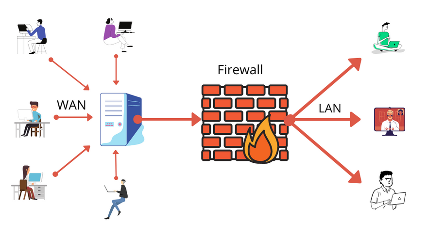

<figure>
  
  <figcaption>출처: https://geekflare.com/firewall-introduction/</figcaption>
</figure>

Firewall은 방화벽이라는 의미로 외부의 접근 또는 외부로의 접근을 필터링해주는 보안프로그램입니다. IP 주소, 포트, 프로토콜, 목적지의 IP 등을 통해 필터링할 수 있습니다. 저는 가상머신에 CentOS 8을 설치하고 firewalld 패키지를 활용해서 간단한 실습을 해봤습니다.
<br>


<br>

CentOS를 설치하면 보통 firewalld는 같이 설치되는데 `rpm -qa` 명령어로 다시 한번 설치되어있는지 확인해보겠습니다.

```console
\[juho@localhost ~\]# rpm -qa firewalld
firewalld-0.8.2-7.el8\_4.noarch
```

<br>

잘 설치가 되어있습니다. 안되어있다면 `sudo yum install firewalld` 를 통해 설치할 수 있습니다.
<br>

실습용 웹페이지를 만들어 봅니다.
<br>


<br>

저는 httpd 패키지를 사용해서 위와 같은 Hello World 페이지를 포트 80에 서비스를 시작했습니다.
<br>

제가 사용하는 CentOS 가상머신 서버의 IP 주소는 192.168.100.128입니다. 클라이언트 역할을 할 윈도우 10 가상머신을 하나 더 설치한 다음에 이 주소로 접근을 시도해보겠습니다.
<br>


<br>

페이지를 불러오지 못합니다.
<br>

리눅스 서버에서 firewall 설정을 보기 위해 다음 명령어를 사용합니다.

```console
\[juho@localhost ~\]$ sudo firewall-cmd --list-all
public (active)
  target: default
  icmp-block-inversion: no
  interfaces: ens33
  sources:
  services: cockpit dhcpv6-client ssh
  ports:
  protocols:
  masquerade: no
  forward-ports:
  source-ports:
  icmp-blocks:
  rich rules:
```

<br>

service에 포트 80인 http를 추가하겠습니다.

```console
\[juho@localhost ~\]$ sudo firewall-cmd --add-service=http
success
```

> service에 http를 추가하는 것 대신에 port에 --add-port=80/tcp 명령어로 포트 80을 열어주는 것도 하나의 방법입니다.

<br>

추가가 됬는지 다시 확인합니다.

```console
\[juho@localhost ~\]$ sudo firewall-cmd --list-all
public (active)
  target: default
  icmp-block-inversion: no
  interfaces: ens33
  sources:
  services: cockpit dhcpv6-client http ssh
  ports:
  protocols:
  masquerade: no
  forward-ports:
  source-ports:
  icmp-blocks:
  rich rules:
```

<br>

이제 다시 클라이언트에서 접근을 시도해보겠습니다.
<br>


페이지를 잘 불러오는 모습입니다.
<br>

이번에는 ssh 접근을 한번 통제해보겠습니다. ssh는 초기에 추가가 되어있기에 접근이 가능할 겁니다.
<br>

클라이언트에서 Putty 프로그램으로 접근을 시도해봤습니다.
<br>


<br>

접근이 허용된 모습입니다.
<br>

이제 서버에서 접근을 제한하도록 하겠습니다.
<br>

```console
\[juho@localhost ~\]$ sudo firewall-cmd --remove-service=ssh
success
```

> ssh는 포트 22를 사용하기 때문에 port=22/tcp로 조정할 수도 있습니다.
> <br>

클라이언트에서 다시 접근을 시도해보겠습니다.
<br>


<br>

접근하지 못하는 모습입니다.
<br>

firewalld 설정을 원래대로 돌려놓겠습니다.
<br>

```console
\[juho@localhost ~\]$ sudo firewall-cmd --reload
success
```

> --reload를 해도 변경사항이 적용되게 하려면 변경명령 뒤에 --permanent를 붙이면 됩니다.
> <br>

간단히 실습을 해봤는데 이 외에도 기존에 설정되어있는 zone을 활용해보는 등의 다양한 시도가 가능합니다.
